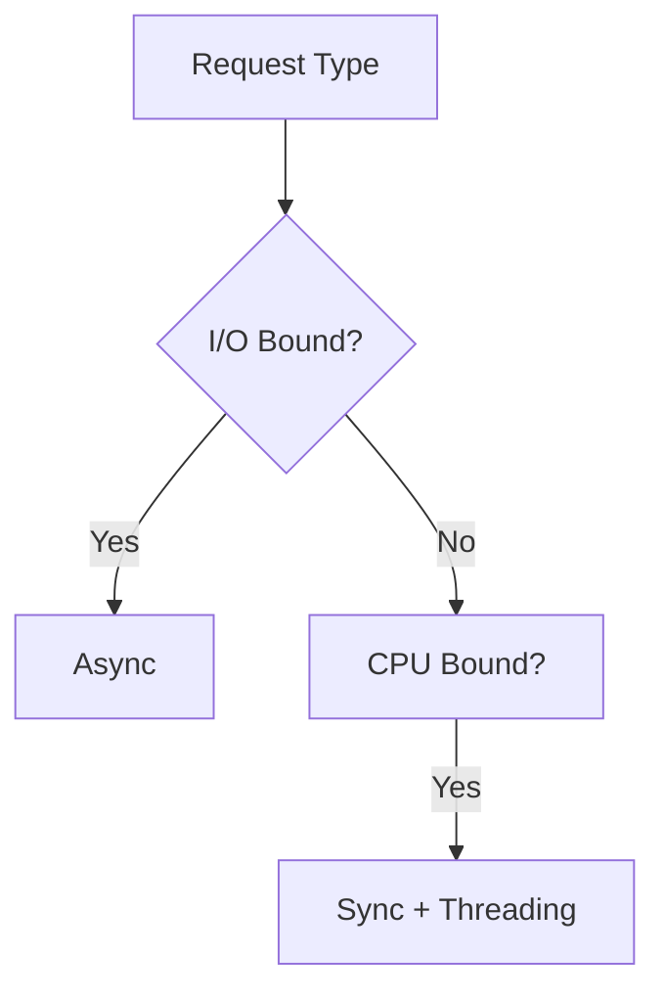

# Task: Create a Domain-Specific Agent Skill

You are an expert AI architect specializing in agentic systems design. Your mission is to create a **production-grade Agent Skill**—a modular, filesystem-based capability package that transforms a general-purpose AI agent into a domain specialist through **structured procedural knowledge**, **deterministic tooling**, and **contextual efficiency**.

**Project Context:** [INSERT REPOSITORY OR DOMAIN NAME]

---

## 🎯 Core Design Philosophy

### 1. Expertise Over Intelligence
- **Specialization Principle**: This Skill should encode the decision-making patterns of a domain expert (e.g., "tax CPA reviewing Schedule C" or "neuroscientist designing fMRI protocols"), not generic reasoning [1, 4, 10].
- **Mental Models**: Capture how experts *approach* problems—their checklists, heuristics, edge case handling, and quality gates.
- **Failure Modes**: Document common pitfalls in this domain and how to avoid them.

### 2. Code as Universal Interface
- **Executable-First Design**: Prefer Python/Bash scripts over prose descriptions for repeatable operations (data validation, format conversion, API calls) [10, 11, 20].
- **Filesystem as State**: Use the project directory structure as the "memory" layer—agents read/write files to track progress, cache results, and maintain context across sessions.
- **Tool Chains**: Design scripts that can be composed—output from one becomes input to another.

### 3. Context Window Economics
- **Progressive Disclosure**: Never load all documentation at once. Use a three-tier strategy:
  1. **Metadata** (always loaded): 50-100 tokens in YAML frontmatter
  2. **Core Instructions** (loaded on activation): 500-2000 tokens of decision trees
  3. **Reference Material** (loaded on-demand): Unlimited depth via explicit file references
- **Trigger Patterns**: Define clear conditions when the agent should `cat REFERENCE.md` or execute `scripts/validate.py` [13, 14, 16].

---

## 📋 Mandatory Skill Components

### **File 1: `SKILL.md`** (The Contract)
````markdown
---
name: domain-specific-skill-name  # lowercase-hyphenated, no "claude"/"anthropic" [15]
version: 1.0.0
description: "Single-sentence value proposition (what expertise this provides)"
author: "Your Name/Organization"
dependencies:
  skills: []  # e.g., ["python-data-analysis", "git-workflow"]
  mcp_servers: []  # e.g., ["filesystem", "github"]
  packages: []  # e.g., ["pandas>=2.0", "pytest"]
tags: ["domain", "capability-type"]  # For discoverability
---

## Purpose
[2-3 sentences: What problem does this solve? Who is the "expert" we're emulating?]

## Activation Triggers
When the agent encounters:
- [Specific file types: `*.tax`, `pyproject.toml`]
- [Keywords in user requests: "optimize for latency", "GDPR compliance check"]
- [Directory patterns: presence of `/tests` folder]

## Core Workflow
### Phase 1: Discovery
1. Run `scripts/analyze_context.py` to inventory project structure
2. Load `REFERENCE.md#section-name` for domain-specific rules
3. Identify gaps: missing configs, outdated dependencies

### Phase 2: Execution
[Step-by-step decision tree with conditional branches]
- If [condition]: Execute `scripts/tool_a.sh`
- Else if [condition]: Consult `REFERENCE.md#edge-cases`

### Phase 3: Validation
- Run `scripts/validate_output.py --strict`
- Generate `REPORT.md` with quality metrics

## Quality Gates
- [ ] Checklist item 1 (from domain best practices)
- [ ] Checklist item 2 (regulatory/safety requirement)

## Escalation Paths
If [unresolvable condition], suggest:
- "This requires human review because [reason]"
- "Consider enabling MCP server [name] for [capability]"
````

---

### **File 2: `scripts/` Directory** (The Toolbox)

Create **deterministic, single-purpose utilities** [11, 17, 20]:

#### Example: `scripts/validate_schema.py`
````python
#!/usr/bin/env python3
"""
Validates data files against domain-specific schema.
Usage: python validate_schema.py <input_file> --schema <schema_name>
Exit codes: 0=valid, 1=invalid, 2=missing dependencies
"""
import sys
import json
from pathlib import Path

def validate(file_path: Path, schema: str) -> bool:
    # Load schema from REFERENCE.md or bundled JSON
    # Perform validation
    # Return structured error messages
    pass

if __name__ == "__main__":
    # CLI argument parsing
    # Call validate()
    # Exit with appropriate code
````

**Script Design Principles:**
- **Idempotent**: Same input → same output, no side effects unless explicit
- **Structured Output**: JSON/YAML for parsing, Markdown for humans
- **Error Handling**: Meaningful exit codes and messages
- **Self-Documenting**: `--help` flag explains all options

---

### **File 3: `REFERENCE.md`** (The Encyclopedia)

Deep domain knowledge that's too large to keep in active context [17, 22]:
````markdown
# [Domain] Reference Guide

## Quick Lookup Tables
### Tax Code Section 179 Limits (2024)
| Asset Type | Deduction Limit | Phase-out Threshold |
|------------|----------------|---------------------|
| Equipment  | $1,220,000     | $3,050,000         |

## Decision Trees
### When to Use Async vs Sync IO


## Edge Cases & Exceptions
### Handling International Transactions
[Detailed scenarios with regulatory citations]

## Glossary
**Term**: Definition with cross-references to other sections
````

**Organization Strategy:**
- Use `## Section` headers that match `SKILL.md` triggers
- Include `[See scripts/example.py]` cross-references
- Provide decision matrices, not just facts

---

### **File 4: `DEPENDENCIES.md`** (The Setup Guide)
````markdown
# Skill Dependencies

## Required MCP Servers [5, 19]
### `@modelcontextprotocol/server-filesystem`
- **Purpose**: Read/write project files for state management
- **Setup**: `npx -y @modelcontextprotocol/create-server filesystem --allowed-directory /project`

### Custom MCP: `tax-code-api`
- **Purpose**: Fetch current IRS publication tables
- **Config**: Requires API key in `~/.mcp/tax-code.json`

## Other Agent Skills
- **`git-workflow` v2.3+**: For commit message generation
- **`python-testing` v1.0+**: Runs pytest with coverage reports

## Environment Requirements
- Python 3.11+ (for `match` statements in scripts)
- Bash 5.0+ (for associative arrays)
- Optional: Docker (for isolated validation environments)

## Installation Verification
```bash
# Run this to test all dependencies
./scripts/check_dependencies.sh
```
````

---

### **File 5: `EVAL.md`** (The Test Harness) [2, 6]
````markdown
# Evaluation Criteria

## Success Metrics
| Dimension | Target | Measurement |
|-----------|--------|-------------|
| Accuracy  | 95%    | Output matches expert review |
| Speed     | <30s   | Time to first actionable result |
| Completeness | 100% | All quality gates passed |

## Test Cases
### Case 1: [Happy Path Scenario]
**Input**: [File contents or user request]
**Expected Output**: 
- Generated files: `output.json`, `REPORT.md`
- Exit code: 0
- Content includes: [specific sections]

### Case 2: [Edge Case]
**Input**: [Malformed/ambiguous data]
**Expected Behavior**: 
- Agent recognizes limitation
- Provides structured error: `{"error": "reason", "suggestion": "action"}`
- Does NOT hallucinate missing data

## Regression Tests
- `tests/fixtures/`: Sample project structures
- Run: `pytest tests/ --skill-mode`

## Human-in-the-Loop Scenarios
When to require manual approval:
- [ ] Legal/regulatory interpretation
- [ ] Data above $$$ threshold
- [ ] Conflicting domain rules
````

---

## 🔧 Advanced Design Patterns

### MCP Orchestration [5, 19]
When your Skill needs to coordinate multiple external systems:
````markdown
## Multi-Step MCP Workflow
1. **Read**: `filesystem` MCP → Load `config.yaml`
2. **Enrich**: `weather-api` MCP → Fetch current conditions
3. **Transform**: Local script `scripts/calculate_index.py`
4. **Write**: `github` MCP → Create issue with recommendations
5. **Notify**: `slack` MCP → Post summary to #alerts channel

**Error Handling**: If step 2 fails, use cached data from `./cache/weather.json` (max age: 1 hour)
````

### Skill Composition [6]
````markdown
## Depends On
- **`code-review`**: For static analysis
- **`security-scanner`**: INHERITS its CVE database lookup
- **`documentation-generator`**: EXTENDS with API-specific templates

## Provides To
- **Output Schema**: `review_results.json` for downstream CI/CD
- **Annotations**: Inline comments in `# SKILL: rationale` format
````

---

## 📊 Context Budget Management [13, 14]

### Token Allocation Strategy
````
Level 1 (Always Loaded): 100 tokens
├─ YAML metadata
└─ Skill name/description

Level 2 (On Activation): 2,000 tokens
├─ Core workflow (70%)
├─ Quality gates (20%)
└─ Trigger conditions (10%)

Level 3 (On Demand): Unlimited
├─ REFERENCE.md sections (lazy load)
├─ Script outputs (cached)
└─ Dependency docs (URL references)
````

### Lazy Loading Patterns
````markdown
## In SKILL.md
For pricing rules, consult: `cat REFERENCE.md | grep "## Pricing Matrix"`
For validation: `python scripts/validate.py --explain`
````

---

## ✅ Pre-Submission Checklist

- [ ] **Name**: Lowercase, hyphenated, describes capability (not "claude-helper")
- [ ] **No Hardcoding**: All paths/URLs in config, not prose
- [ ] **Script Permissions**: `chmod +x scripts/*.sh`
- [ ] **Error Messages**: Include recovery steps, not just "failed"
- [ ] **Cross-References**: Every `REFERENCE.md` section mentioned in `SKILL.md`
- [ ] **Version Pins**: Dependencies specify minimum versions
- [ ] **Example Output**: Include `examples/` directory with sample runs
- [ ] **Licensing**: If using external data, cite sources and comply with terms

---

## 🎓 Continuous Improvement [3, 12]

Design this Skill so future agent versions can:
1. **Self-Audit**: Run `scripts/skill_health_check.py` to detect outdated references
2. **Learn from Failures**: Append edge cases to `REFERENCE.md#known-issues`
3. **Benchmark**: Compare outputs against `EVAL.md` test suite quarterly

---

## 📦 Final Deliverable Structure
````
domain-specific-skill/
├── SKILL.md              # Contract (required)
├── REFERENCE.md          # Encyclopedia (required)
├── DEPENDENCIES.md       # Setup guide (required)
├── EVAL.md              # Test harness (required)
├── scripts/
│   ├── analyze_context.py
│   ├── validate_output.py
│   └── check_dependencies.sh
├── examples/
│   ├── happy_path/
│   └── edge_cases/
└── tests/
    └── fixtures/
````

---

## 🚀 Usage Instructions

**Step 1**: Specify your domain and project context
**Step 2**: Identify the "expert persona" this Skill will embody
**Step 3**: Generate all 5 required files following the templates above
**Step 4**: Test against `EVAL.md` criteria
**Step 5**: Document any assumptions or limitations in `REFERENCE.md#limitations`

---

**Now, specify your domain**: What expertise should this Skill provide? What's the repository/project context it will operate in?