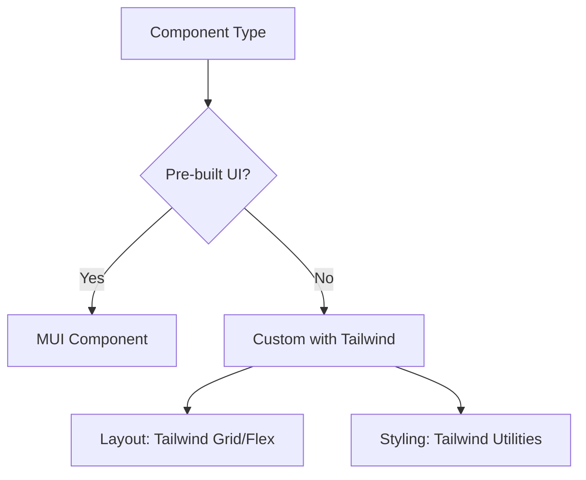

# React MUI Tailwind Playwright Reference Guide

## Setup Checklist
### Environment Requirements
- Node.js 18+
- npm or yarn
- VS Code with React/JS extensions

### Package Installation
```bash
npm install react @mui/material @emotion/react @emotion/styled tailwindcss @playwright/test
npx tailwindcss init
npx playwright install
```

## MUI and Tailwind Integration
### Theme Configuration
```javascript
// theme.js
import { createTheme } from '@mui/material/styles';

const theme = createTheme({
  palette: {
    primary: {
      main: '#your-tailwind-primary',
    },
  },
});

export default theme;
```

### Component Styling Pattern
```jsx
import { Button } from '@mui/material';
import 'tailwindcss/base';
import 'tailwindcss/components';
import 'tailwindcss/utilities';

function MyComponent() {
  return (
    <Button className="bg-blue-500 hover:bg-blue-700 text-white font-bold py-2 px-4 rounded">
      MUI + Tailwind Button
    </Button>
  );
}
```

## Playwright Testing Strategies
### Component Testing
```javascript
// tests/component.spec.js
import { test, expect } from '@playwright/test';

test('button renders correctly', async ({ page }) => {
  await page.goto('http://localhost:3000');
  const button = page.locator('button');
  await expect(button).toBeVisible();
  await expect(button).toHaveClass(/bg-blue-500/);
});
```

### Accessibility Testing
```javascript
test('component is accessible', async ({ page }) => {
  await page.goto('http://localhost:3000');
  const results = await page.evaluate(() => {
    return axe.run();
  });
  expect(results.violations).toHaveLength(0);
});
```

## Decision Trees
### When to Use MUI vs Tailwind


## Edge Cases & Exceptions
### Dark Mode Implementation
- Use MUI's `ThemeProvider` with `useMediaQuery`
- Tailwind: `dark:` prefix with `class` strategy
- Test both modes in Playwright

### Responsive Design
- MUI: `useMediaQuery` for breakpoints
- Tailwind: `sm:`, `md:`, `lg:` prefixes
- Ensure mobile-first approach

## Glossary
**MUI Theme**: Centralized configuration for colors, typography, spacing
**Tailwind Utility**: Single-purpose CSS class like `text-center` or `bg-red-500`
**Playwright Locator**: Method to find elements on page for testing
