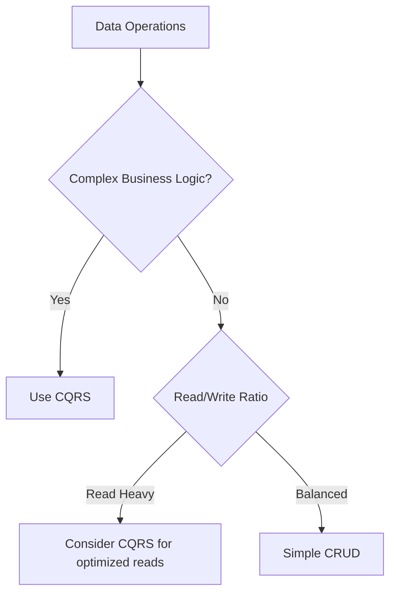
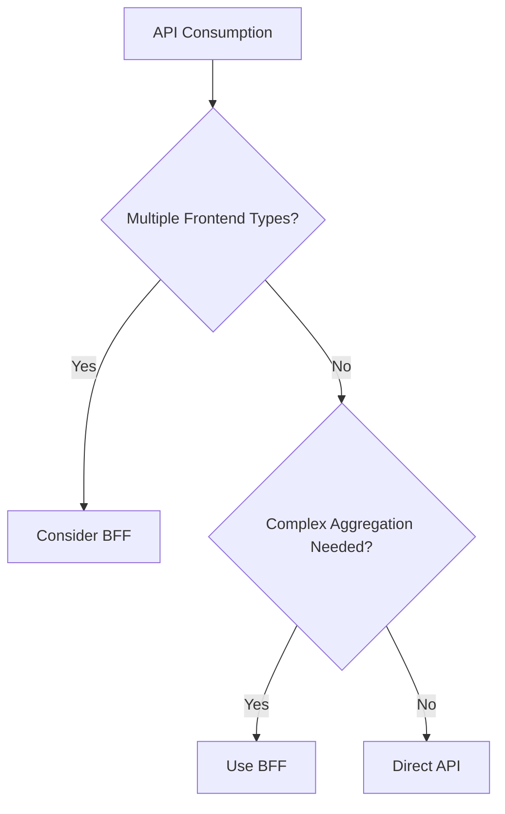
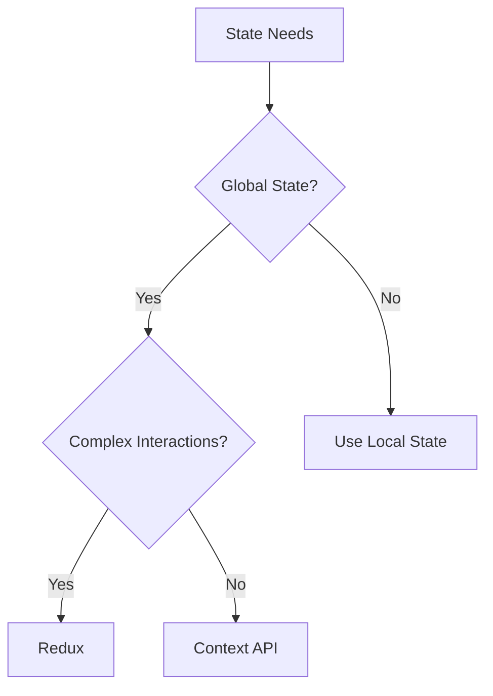

# .NET React Fullstack Reference Guide

## Architecture Overview
Clean Architecture organizes code into concentric layers: Domain (core business logic), Application (use cases), Infrastructure (external concerns), and Presentation (UI/API). CQRS separates read and write models for better scalability. BFF optimizes API responses for specific frontend needs.

## Clean Architecture Implementation
### Layer Structure
- **Domain**: Entities, Value Objects, Domain Services, Interfaces
- **Application**: Commands, Queries, Handlers, DTOs
- **Infrastructure**: EF Core Context, Repositories, External Services
- **Presentation**: Controllers, Middleware, API Endpoints

### Key Principles
- Dependency Inversion: Inner layers don't depend on outer layers
- Single Responsibility: Each class has one reason to change
- Dependency Injection: Use DI containers for loose coupling

## CQRS Pattern
### Command Side
- Commands: Represent intent to change state
- Command Handlers: Execute business logic, update aggregates
- Validation: Use Fluent Validation on commands

### Query Side
- Queries: Request data for display
- Query Handlers: Fetch and shape data from read models
- Optimization: Use projections for efficient reads

### Implementation Steps
1. Define Commands/Queries as records or classes
2. Create handlers implementing IRequestHandler<TRequest, TResponse>
3. Register handlers in DI container
4. Use MediatR for dispatching

## Entity Framework Code First
### Configuration
- Use DbContext with OnModelCreating for entity configurations
- Apply configurations using ApplyConfiguration
- Use migrations: `dotnet ef migrations add InitialCreate`

### Best Practices
- Use async/await for all database operations
- Implement repository pattern for testability
- Use value objects for complex types
- Handle concurrency with RowVersion

## PostgreSQL Integration
### Connection String
Use Npgsql provider: `Host=localhost;Database=mydb;Username=user;Password=pass`

### Features
- JSONB for flexible data storage
- Full-text search capabilities
- PostGIS for geospatial data (if needed)

## RESTful API Design
### HTTP Methods
- GET: Retrieve resources
- POST: Create resources
- PUT: Update entire resource
- PATCH: Partial updates
- DELETE: Remove resources

### Status Codes
- 200 OK: Success
- 201 Created: Resource created
- 400 Bad Request: Invalid input
- 404 Not Found: Resource doesn't exist
- 500 Internal Server Error: Server error

### Best Practices
- Use plural nouns for resource names
- Implement HATEOAS for discoverability
- Version APIs with URL prefixes (e.g., /api/v1/)

## Backend for Frontend (BFF)
### Purpose
Optimize API responses for specific frontend requirements, reducing over/under-fetching.

### Implementation
- Create separate BFF service or layer
- Aggregate data from multiple microservices
- Transform data to match frontend needs
- Handle authentication/authorization

## Refit Library Usage
### Setup
```csharp
public interface IApiClient
{
    [Get("/users/{id}")]
    Task<User> GetUser(int id);
}
```

### Configuration
- Register in DI: `builder.Services.AddRefitClient<IApiClient>()`
- Add resilience: Polly policies for retry/circuit breaker
- Handle authentication: Add auth headers via DelegatingHandler

## Fluent Validation
### Rule Definition
```csharp
public class CreateUserCommandValidator : AbstractValidator<CreateUserCommand>
{
    public CreateUserCommandValidator()
    {
        RuleFor(x => x.Email).EmailAddress();
        RuleFor(x => x.Name).NotEmpty().MaximumLength(100);
    }
}
```

### Integration
- Register validators in DI
- Use in command handlers or controllers
- Customize error messages for user-friendly responses

## React 18+ with TypeScript
### Component Patterns
- Functional components with hooks
- Custom hooks for reusable logic
- Higher-order components for cross-cutting concerns

### TypeScript Best Practices
- Use strict mode
- Define interfaces for props and state
- Use union types for variant props
- Leverage utility types (Partial, Pick, etc.)

## Redux State Management
### Store Structure
```
{
  ui: { loading: false, error: null },
  data: { users: [], selectedUser: null },
  auth: { user: null, token: null }
}
```

### Actions and Reducers
- Use action creators or createAction from Redux Toolkit
- Implement slice reducers with Immer
- Use createAsyncThunk for async operations

### Best Practices
- Normalize state structure
- Use selectors for computed values
- Implement middleware for logging and async handling
- Use Redux DevTools for debugging

## Playwright UI Testing
### Test Structure
```typescript
test.describe('User Management', () => {
  test('should create new user', async ({ page }) => {
    await page.goto('/users');
    await page.fill('[name="email"]', 'test@example.com');
    await page.click('button[type="submit"]');
    await expect(page.locator('text=User created')).toBeVisible();
  });
});
```

### Best Practices
- Use page object model for maintainability
- Implement fixtures for test data
- Use visual comparisons for UI consistency
- Run tests in parallel for speed
- Handle flaky tests with retries and stable selectors

## Decision Trees
### When to Use CQRS vs Simple CRUD


### Choosing Between BFF and Direct API


### React State Management Choice


## Edge Cases & Exceptions
### Handling Concurrency in EF Core
Use optimistic concurrency with RowVersion. Handle DbUpdateConcurrencyException by reloading and retrying.

### React Component Re-rendering Issues
Use React.memo, useMemo, useCallback to prevent unnecessary re-renders. Profile with React DevTools.

### Playwright Test Flakiness
Use stable selectors, wait for network requests to complete, implement proper cleanup in afterEach hooks.

### CQRS Eventual Consistency
Accept that read models may be stale. Use domain events to update read models asynchronously.

### Fluent Validation Complex Rules
Use Must() with custom validation functions for complex business rules.

## Glossary
**Aggregate**: A cluster of domain objects that can be treated as a single unit for data changes.

**Command**: An object representing an intent to change the system state.

**Query**: An object representing a request for information from the system.

**DTO**: Data Transfer Object - a simple object for transferring data between layers.

**Entity**: An object with identity that changes over time.

**Value Object**: An immutable object without identity, defined by its attributes.

**Repository**: An abstraction over data access, providing collection-like interface.

**Handler**: A class that processes commands or queries in CQRS pattern.

**Slice**: A portion of Redux state with its reducers and actions.

**Selector**: A function that extracts specific data from Redux state.

**Fixture**: Predefined test data or state for consistent testing.